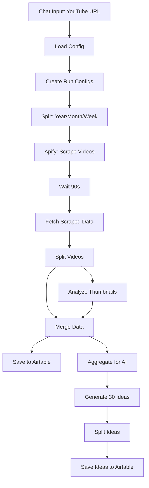

# YouTube Content Research and AI-Powered Video Idea Generator

An intelligent n8n workflow that analyzes successful YouTube channels, scrapes top-performing videos, and generates 30 unique, data-driven video ideas using AI. Perfect for content creators looking to create viral content based on proven trends.

## 🌟 Features

- **Competitive Research**: Scrapes top videos from any YouTube channel across multiple timeframes
- **AI Thumbnail Analysis**: Uses GPT-4o-mini vision to analyze what makes thumbnails clickable
- **Smart Trend Detection**: Categorizes content by recency (Weekly, Monthly, Yearly)
- **Psychological Analysis**: Identifies triggers in titles and thumbnails that drive engagement
- **30 Unique Video Ideas**: Generates complete video concepts with titles, angles, and outlines
- **Data Storage**: Saves all research and ideas to Airtable for easy management

## 📋 Prerequisites

- n8n instance (self-hosted or cloud)
- Apify account with API access
- OpenAI API key (GPT-4o-mini and GPT-4.1-mini)
- Airtable account with base setup

## 🔧 Required Credentials

1. **Apify API Token** - For YouTube scraping
2. **OpenAI API Key** - For thumbnail analysis and idea generation
3. **Airtable API** - For data storage

## 🗄️ Airtable Setup

### Table 1: Video Ideas (Generated Content)

| Field Name | Type | Description |
|------------|------|-------------|
| title | Single line text | Video title |
| concept | Long text | Concept and angle |
| thumbnail | Long text | Thumbnail description |
| talking_points | Long text | Key points outline |
| justification | Long text | Trend justification |

### Table 2: Scraped Videos (Research Data)

| Field Name | Type | Description |
|------------|------|-------------|
| post_title | Single line text | Original video title |
| views | Number | View count |
| likes | Number | Like count |
| username | Single line text | Channel name |
| subscribers | Number | Subscriber count |
| thumbnail_description | Long text | AI analysis of thumbnail |
| thumbnail_url | URL | Thumbnail image URL |
| post_url | URL | Video URL |
| posted_at | Date | Upload date |
| scraped_at | Date | Data collection date |

## 🚀 Installation

1. **Import Workflow**
   ```bash
   # In n8n interface
   - Navigate to Workflows
   - Click "Import from File"
   - Select the JSON file
   ```

2. **Configure API Keys**
   
   Update these placeholders in the "Workflow Configuration" node:
   - `<__PLACEHOLDER_VALUE__Your Apify API Token__>`
   - `<__PLACEHOLDER_VALUE__Your OpenAI API Key__>`

3. **Setup Airtable**
   
   Update these placeholders:
   - `<__PLACEHOLDER_VALUE__Your Airtable Base ID__>` (for video ideas)
   - `<__PLACEHOLDER_VALUE__Your Airtable Table Name__>` (for video ideas)
   - `<__PLACEHOLDER_VALUE__Your Airtable Base ID for Scraped Videos__>`
   - `<__PLACEHOLDER_VALUE__Your Scraped Videos Table Name__>`

4. **Activate Chat Interface**
   - The workflow uses n8n's Chat Trigger
   - Access via the webhook URL provided in the trigger node

## 🔄 Workflow Process



## 💡 How to Use

1. **Start the Workflow**
   - Open the n8n chat interface
   - Paste a YouTube channel URL

2. **Example Input**
   ```
   https://www.youtube.com/@MrBeast
   ```

3. **Wait for Processing**
   - Scraping: ~90 seconds per timeframe
   - Thumbnail analysis: ~2-3 seconds per video
   - AI generation: ~30-60 seconds

4. **Review Results in Airtable**
   - Scraped videos table: Raw research data
   - Video ideas table: 30 ready-to-use concepts

## 🎯 AI Analysis Features

### Thumbnail Analysis (GPT-4o-mini Vision)
Analyzes each thumbnail for:
- Visible text elements
- Main visual components
- Color schemes and mood
- Attention-grabbing elements

### Video Idea Generation (GPT-4.1-mini)
Creates ideas based on:
- **Recency Analysis**: Weekly, Monthly, Yearly trends
- **Psychological Triggers**: What makes content clickable
- **Engagement Metrics**: Views-to-subscribers ratio
- **Content Gaps**: Opportunities competitors missed

### Output for Each Video Idea

```json
{
  "new_video_title": "Catchy, optimized title",
  "concept_and_angle": "Unique approach and positioning",
  "suggested_thumbnail_description": "Visual strategy for maximum CTR",
  "key_talking_points_outline": "Structured content outline",
  "trend_justification": "Why this will perform well"
}
```

## ⚙️ Configuration Options

### Scraping Settings (runConfigs node)

```javascript
{
  "filter": "year",      // Time filter: year, month, week
  "results": 30,         // Number of videos to scrape
  "channelUrl": "..."    // Target channel URL
}
```

Default configuration:
- **Yearly**: Top 30 videos by views
- **Monthly**: Top 15 videos by views
- **Weekly**: Top 5 videos by views

### AI Model Parameters

**Thumbnail Analysis**:
- Model: `gpt-4o-mini`
- Max tokens: 300
- Temperature: Default

**Idea Generation**:
- Model: `gpt-4.1-mini`
- Temperature: Default
- Output: Structured JSON (30 ideas)

## 🔍 Advanced Features

### Strategos AI System Prompt

The workflow includes a sophisticated AI persona called "Strategos AI" that:
- Acts as a YouTube Content Strategist
- Applies behavioral science principles
- Focuses on psychological triggers
- Emphasizes lead generation strategies

### Trend Categorization

Videos are automatically categorized:
- **Evergreen/Yearly**: 3-4+ months old
- **Current/Monthly**: 1-3 months old
- **Fresh/Weekly**: 1-4 weeks old

### Psychological Analysis

Identifies triggers such as:
- Curiosity gaps
- Social proof
- FOMO (Fear of Missing Out)
- Novelty and surprise
- Authority and credibility

## 🐛 Troubleshooting

### Common Issues

1. **Apify Scraping Fails**
   - Verify API token is valid
   - Check Apify account quota
   - Ensure channel URL is correct format

2. **Thumbnail Analysis Errors**
   - Confirm OpenAI API key has GPT-4o-mini access
   - Check image URLs are accessible
   - Verify API rate limits

3. **No Ideas Generated**
   - Review AI model permissions
   - Check output parser configuration
   - Verify JSON structure in response

4. **Airtable Save Errors**
   - Confirm base and table IDs are correct
   - Check field name mappings
   - Verify API permissions

### Debug Tips

- Enable "Always Output Data" on nodes
- Check execution logs for API errors
- Test with a small channel first
- Monitor wait times (may need adjustment)

## 📊 Performance Optimization

### Speed Improvements
- Reduce `results` in runConfigs for faster processing
- Decrease wait time if Apify runs complete quickly
- Use batch processing for multiple channels

### Cost Optimization
- Limit video scraping to most relevant timeframes
- Use GPT-4o-mini for all analysis (cheaper than GPT-4)
- Set up caching for repeated channels

## 🎨 Customization

### Modify AI Persona
Edit the system message in "Video Ideas Generator Agent" to:
- Change content focus (gaming, tech, lifestyle, etc.)
- Adjust tone (educational, entertaining, professional)
- Target different audience demographics

### Change Scraping Filters
Modify `runConfigs` to scrape by:
- Upload date
- Popularity
- Duration
- Engagement rate

### Add More Platforms
Extend the workflow to analyze:
- TikTok content
- Instagram Reels
- Twitter/X threads

## 📈 Use Cases

1. **Content Strategy Planning**
   - Research competitors systematically
   - Identify trending topics
   - Plan content calendar

2. **Thumbnail Optimization**
   - Learn from successful designs
   - Understand visual patterns
   - Improve click-through rates

3. **Title Optimization**
   - Analyze high-performing titles
   - Identify keyword patterns
   - Test different angles

4. **Trend Forecasting**
   - Spot emerging topics early
   - Capitalize on viral patterns
   - Stay ahead of competition

## 🔒 Privacy & Ethics

- Only scrapes public YouTube data
- Respects platform rate limits
- Uses data for research purposes
- Generate original content (don't copy)

## 📄 License

This workflow is provided as-is for content research and ideation. Ensure compliance with:
- YouTube Terms of Service
- Apify Terms of Service
- OpenAI Usage Policies
- Copyright laws

## 🤝 Contributing

Contributions welcome! Areas for improvement:
- Additional platform support
- Enhanced AI prompts
- Better data visualization
- Performance optimizations

## 💰 Estimated Costs

Per execution (approximate):
- Apify: $0.10-0.50 (depending on video count)
- OpenAI GPT-4o-mini: $0.10-0.30 (thumbnail analysis)
- OpenAI GPT-4.1-mini: $0.05-0.15 (idea generation)
- Total: ~$0.25-1.00 per run

## 📞 Support Resources

- **n8n Documentation**: https://docs.n8n.io/
- **Apify Support**: https://docs.apify.com/
- **OpenAI API Docs**: https://platform.openai.com/docs
- **Airtable API**: https://airtable.com/developers/web/api

## 🎯 Best Practices

1. **Test with smaller channels first** (10-100K subscribers)
2. **Run during off-peak hours** to respect API limits
3. **Review AI outputs** before implementing ideas
4. **Track which ideas perform best** for continuous improvement
5. **Update prompts regularly** based on platform trends

---

**Built for content creators who want to work smarter, not harder** 🚀

*Last updated: December 2025*
